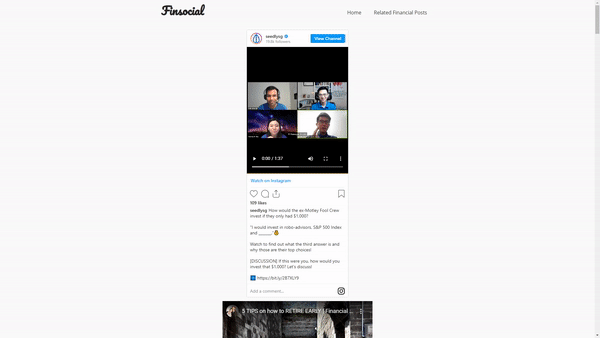

## Overview

There is an uprising in influencers who’s popularity is based on their financial wisdom. As we are constantly overloaded with financial information, it is hard to keep track of who and what to follow.

Finsocial provides users with financial knowledge from the various social media platforms in hopes to keep users engaged and entertained via viral content from financial influencers.

## Solution Architecture

## Functionalities

### Home page

A lambda script will scrape the 4 social media platforms daily at 6am to pull new data from the content creators to be piped back to MongoDB. The home page displays all the recent post for the user.

### Related Financial News

Twitter is used as our master node as it is mainly text based. Using nltk we are able to remove stop words and extract the important context of the tweet. we will then use the Youtube search API to get 20 videos based on the context and take the top 3 videos based on views.

Another layer of search is done to on the highest viewed video of the previous layer to check for more videos. It will then be added to the current 3 videos which will result in 5 videos where we will take the top 3 most viewed videos. This will allow us to obtain a more contextual storyline.

